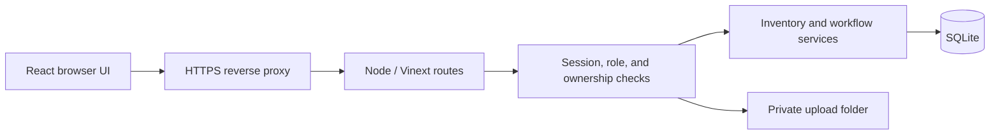

# Frontend, backend, and data architecture

## Stack

React 19.2.6 and TypeScript implement the browser interface. Vinext 1.0.0-beta.5 with Vite 8.0.13 builds and serves the application. Tailwind CSS 4 and existing shadcn/Base UI components support presentation. Versions are pinned in package.json and pnpm-lock.yaml. Vinext is a beta dependency: validate every framework upgrade in staging before release.

The company server runs Node.js 24, built-in SQLite, and a persistent local upload folder. The original Cloudflare D1/R2 runtime has been replaced. Cloudflare type definitions remain for compatibility with the existing service interfaces; no Cloudflare account is needed to run this edition. Original deployment tooling dependencies in the lockfile are not used by the new Vite configuration.

## Source organization

| Location | Responsibility |
|---|---|
| app/page.tsx | Existing IT workspace, profiles, inventory, forms and workflows |
| components/access-shell.tsx | Login, password change, access management, own-record portal |
| app/api | HTTP boundaries and server permission enforcement |
| lib | Existing business validation and workflow services |
| server/auth.mjs | Password hashing, sessions, throttling, role checks and audit |
| server/database.mjs | Node SQLite adapter preserving existing prepared-statement contracts |
| server/auth-schema.sql | Initial application identity schema |
| drizzle | Existing versioned business schema migrations |
| scripts | Database initialization, account setup, import and backup |
| tests | Authentication and API isolation checks |

The frontend does not decide authorization. Business routes require Admin or Super Admin on every request. User views use a separate endpoint whose employee ID comes exclusively from the authenticated session's account link.

## Data model

- employees is the employee master; its IDs remain stable through migration.
- assets stores equipment/software metadata; assignments relates employees to items, including historical returns.
- account_requests tracks Google Workspace/Microsoft 365 provisioning separately from hardware. Identical email addresses can be recorded for the two providers.
- kit_templates, employee_kits and kit_tasks organize onboarding deliverables.
- maintenance and asset_events preserve equipment service/history; events records employee workflow activity.
- employee_forms, form_applications and form_asset_links retain submissions, processing receipts and equipment references.
- form_files stores upload metadata; binary files live under DATA_DIR/uploads, outside public web assets.
- app_users stores username, optional email, role, optional unique employee link, password hash and status.
- app_sessions stores token hashes and expiry; auth_limits stores bounded attempt counters; security_events records application access administration.

SQLite uses WAL, foreign keys, prepared statements and synchronous transaction boundaries. Run one application instance with local persistent storage. Do not place the database on an SMB/NFS share or scale replicas against the same file. For multi-instance scaling, plan a database-adapter migration and concurrency tests first.

## HTTP permissions

| Endpoint | Access |
|---|---|
| GET /api/auth | Authenticated login state, including forced-password-change state |
| POST /api/auth | Login, logout and own password change; exact Origin required |
| GET/POST /api/workspace | Admin or Super Admin only |
| POST /api/import | Super Admin only |
| GET/POST /api/users | Super Admin: all roles. Admin: User logins only. Create, edit, delete, link, reset and disable. |
| POST /api/records | Admin/Super Admin: edit employees and delete unused employees/assets; preserve linked history. |
| GET/POST /api/departures | Admin/Super Admin: departure archive and authenticated IT sign-off. Users can read only their own linked documents. |
| GET /api/me | Own linked employee records only |
| POST /api/form-files | Admin or Super Admin; image validation and size limit |
| GET /api/form-files?id=... | Admin/Super Admin, or User owning the linked form |

Mutations require the configured Origin, even for signed-in accounts. Responses with identity or business data are not publicly cacheable. Role changes, password resets, employee relinking and disabling revoke affected sessions.

## Authentication

Usernames are case-insensitive and contain 3–64 letters, numbers, dots, underscores or hyphens. Email is optional and independent of an employee's company email. Passwords are 12–128 characters, salted and hashed with scrypt. Temporary passwords must be changed before business data is accessible. Sessions expire after eight hours and use HttpOnly, SameSite=Strict cookies, with Secure on HTTPS. Password reset is performed by a Super Admin, or by an Admin for a User login; email-based reset and MFA are not included.

Official implementation references: [Node SQLite](https://nodejs.org/docs/latest-v24.x/api/sqlite.html), [Node crypto](https://nodejs.org/docs/latest-v24.x/api/crypto.html), [Vinext source](https://github.com/cloudflare/vinext).
